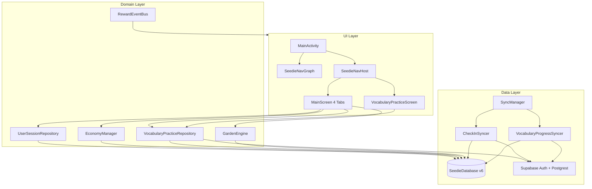
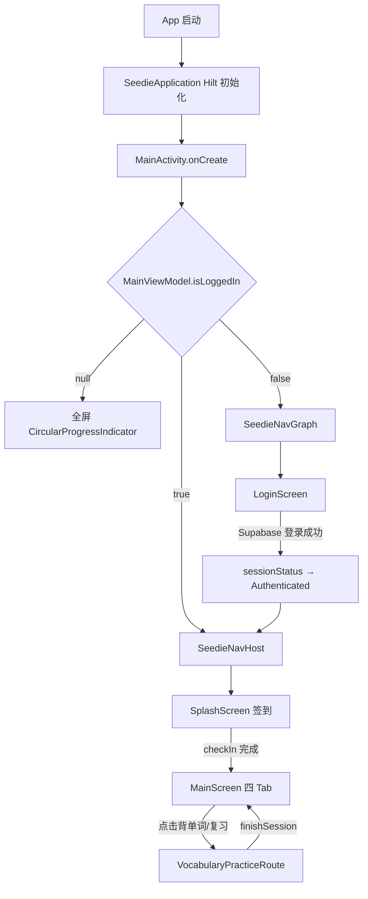
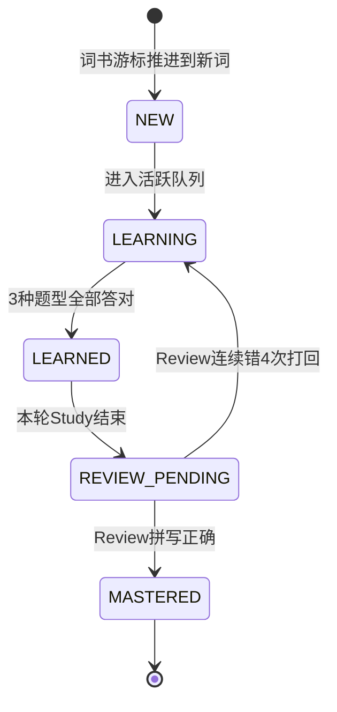
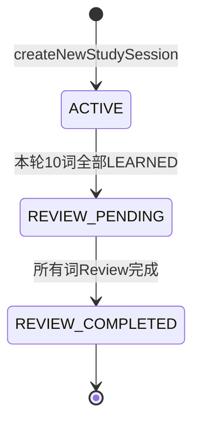
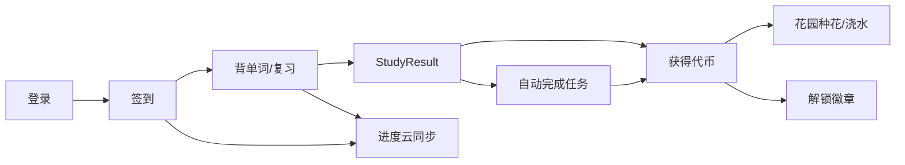

# Seedie 项目功能说明

> 面向新接手开发者的完整项目说明文档。  
> 文档基于代码实际状态编写（截至 `docs/2026-05-27/changelog.md`），以源码为准，spec 设计稿仅作参考。  
> 最后更新：2026-06-28

---

## 目录

1. [项目简介与目录结构](#1-项目简介与目录结构)
2. [技术栈与构建配置](#2-技术栈与构建配置)
3. [整体架构](#3-整体架构)
4. [应用启动与导航流程](#4-应用启动与导航流程)
5. [已实现功能详解](#5-已实现功能详解)
6. [数据层详解](#6-数据层详解)
7. [UI 主题与设计规范](#7-ui-主题与设计规范)
8. [进行中 / 未实现功能](#8-进行中--未实现功能)
9. [关键文件索引](#9-关键文件索引)
10. [新人上手建议](#10-新人上手建议)

---

## 1. 项目简介与目录结构

### 1.1 项目概览

| 项 | 值 |
|---|---|
| 工作区文件夹名 | `EnglishApp` |
| 产品名 | **Seedie** |
| Gradle 项目名 | `Seedie` |
| 包名 / applicationId | `com.example.seedie` |
| 模块结构 | 单模块 `:app` |
| UI 框架 | 100% Jetpack Compose，横屏锁定 |
| 架构模式 | Clean Architecture + Hilt DI + Room + Supabase |
| Kotlin 源文件 | 约 118 个 |

Seedie 是一款面向平板横屏场景的**英语学习 + 游戏化激励** Android 应用。核心玩法是：用户通过背单词等学习行为获得代币，代币可在虚拟花园中种植、浇水，同时解锁成就徽章。应用采用 Supabase 作为云端后端，支持多租户账号体系（机构/学生角色）和学习进度云同步。

### 1.2 顶层目录结构

```
EnglishApp/
├── app/                          # 唯一 Android 应用模块
│   ├── build.gradle.kts          # 应用构建配置与依赖
│   ├── proguard-rules.pro
│   └── src/
│       ├── main/                 # 生产代码（Kotlin + Manifest + res）
│       ├── test/                 # 单元测试（占位）
│       └── androidTest/          # 仪器测试（占位）
├── docs/                         # 开发文档（按日期分文件夹）
│   ├── project_overview.md       # 本文档
│   ├── 2026-03-28/spec/          # 原始技术 spec
│   └── 2026-05-27/               # 最新 changelog / todo（Phase 3）
├── supabase/migrations/          # Supabase SQL 迁移脚本
├── gradle/
│   ├── libs.versions.toml        # 版本目录（依赖版本统一管理）
│   └── wrapper/
├── settings.gradle.kts           # 仅 include(":app")
├── build.gradle.kts              # 根构建插件
├── gradle.properties
└── README.md                     # 仓库简介与技术栈
```

### 1.3 文档说明

根目录 [`README.md`](../../README.md) 为仓库简介与技术栈速查；详细功能与架构以本文档为准。开发状态请以日期文件夹中的 changelog 为准（另有 `web/` B 端控制台）：

- 较新进度示例：[`docs/2026-07-27/changelog.md`](../2026-07-27/changelog.md)
- Phase 3 待办（历史）：[`docs/2026-05-27/todo_list.md`](../2026-05-27/todo_list.md)
- 原始设计 spec：[`docs/2026-03-28/spec/spec.md`](../2026-03-28/spec/spec.md)

### 1.4 应用包结构

Kotlin 源码根包：`com.example.seedie`

```
com.example.seedie/
├── MainActivity.kt               # 唯一 Activity，登录状态路由分发
├── MainViewModel.kt              # 根 ViewModel：Auth 会话门控
├── SeedieApplication.kt          # @HiltAndroidApp 入口
├── di/                           # Hilt 依赖注入模块
├── domain/                       # 领域层：接口、模型、用例
│   ├── model/
│   ├── repository/
│   └── usecase/
├── data/                         # 数据层：Room、Supabase、Repository 实现
│   ├── local/                    # Room DB、Entity、DAO、DataStore
│   ├── remote/                   # Supabase 客户端、AuthService
│   ├── repository/               # Repository 实现
│   └── sync/                     # 离线同步管理器与 Syncer
└── ui/                           # 表现层：Compose 屏幕、导航、主题
    ├── navigation/
    ├── components/
    ├── theme/
    └── screens/
        ├── splash/               # 签到
        ├── login/                # 登录
        ├── main/                 # 四 Tab 主壳
        ├── dashboard/            # Tab 1 首页
        ├── learning/             # Tab 2 学习中心
        │   └── practice/         # 词汇练习（核心）
        ├── garden/               # Tab 3 数据花园
        └── profile/              # Tab 4 个人中心
```

---

## 2. 技术栈与构建配置

### 2.1 核心版本

来源：[`app/build.gradle.kts`](../app/build.gradle.kts)、[`gradle/libs.versions.toml`](../gradle/libs.versions.toml)

| 类别 | 技术 | 版本 |
|------|------|------|
| Android Gradle Plugin | AGP | 9.1.1 |
| Gradle | — | 9.3.1 |
| Kotlin | — | 2.2.10 |
| KSP | — | 2.3.2 |
| minSdk | — | 24（Android 7.0） |
| targetSdk / compileSdk | — | 36 |
| Java 兼容 | — | 11 |
| Compose BOM | — | 2025.01.00 |
| Hilt | — | 2.59 |
| Room | — | 2.8.3 |
| Navigation Compose | — | 2.8.5 |
| Coroutines | — | 1.10.1 |
| Supabase Kotlin SDK | BOM | 3.5.0 |
| Ktor Client | — | 3.4.2 |
| DataStore | — | 1.2.0 |

### 2.2 Gradle 插件

- `com.android.application`
- `org.jetbrains.kotlin.plugin.compose`
- `org.jetbrains.kotlin.plugin.serialization`
- `com.google.dagger.hilt.android`
- `com.google.devtools.ksp`

### 2.3 主要依赖

| 用途 | 库 |
|------|-----|
| UI | Compose Material3、material-icons-extended、Activity Compose |
| 依赖注入 | Hilt + Hilt Navigation Compose |
| 本地数据库 | Room runtime/ktx + KSP compiler |
| 导航 | Navigation Compose |
| 后端 | Supabase Auth + Postgrest、Ktor Android |
| 本地偏好 | DataStore Preferences |

**尚未引入**：ExoPlayer（Phase 3 Step 8 计划用于单词音频播放）

### 2.4 Manifest 要点

来源：[`app/src/main/AndroidManifest.xml`](../app/src/main/AndroidManifest.xml)

- 权限：`INTERNET`、`ACCESS_NETWORK_STATE`
- Application 类：`SeedieApplication`（Hilt）
- 唯一 Activity：`MainActivity`，**横屏锁定**（`screenOrientation="landscape"`）
- 无 Fragment，无 XML Navigation Graph

### 2.5 应用入口

1. **`SeedieApplication`** — 标注 `@HiltAndroidApp`，初始化 Hilt 组件树
2. **`MainActivity`** — 标注 `@AndroidEntryPoint`，根据登录状态切换两个 NavHost

---

## 3. 整体架构

### 3.1 分层架构图



### 3.2 各层职责

| 层 | 路径 | 职责 |
|----|------|------|
| UI | `ui/` | Jetpack Compose 屏幕、ViewModel、导航、主题 |
| Domain | `domain/` | Repository 接口、领域模型、GardenEngine、RewardEventBus |
| Data | `data/` | Room DAO/Entity、Supabase 客户端、Repository 实现、Sync |

### 3.3 依赖注入（Hilt）

| 模块 | 文件 | 提供内容 |
|------|------|----------|
| AppModule | `di/AppModule.kt` | `@ApplicationScope CoroutineScope`、SupabaseClient、AuthService |
| DatabaseModule | `di/DatabaseModule.kt` | SeedieDatabase + 全部 12 个 DAO |
| RepositoryModule | `di/RepositoryModule.kt` | UserSessionRepository、EconomyManager、VocabularyPracticeRepository 绑定 |
| SyncModule | `di/SyncModule.kt` | SyncManager、NetworkConnectivityObserver |
| DispatcherModule | `di/DispatcherModule.kt` | `Dispatchers.IO` |

通过 `@Inject constructor` 自动注入的类：`GardenEngine`、`RewardEventBus`、`CheckInSyncer`、`VocabularyProgressSyncer`、`SyncManagerImpl`、`DevicePreferencesRepository`，以及所有 `@HiltViewModel`。

### 3.4 架构偏差说明

实际代码与 spec 中的严格 Clean Architecture 存在以下偏差，新人需注意：

1. **Domain 层引用 UI 类型**：`VocabularyPracticeRepository` 接口直接引用 `ui/screens/learning/practice/` 下的 `VocabularyPracticeArgs`、`VocabularyPracticeSession` 等类型，domain 与 UI 未完全解耦。
2. **GardenEngine 依赖 Data Entity**：`GardenEngine` 直接操作 `GardenPlotEntity` 和 `GardenPlotDao`，未经过 domain model 转换。
3. **单一代币账本**：`EconomyManager`（Room + 云端同步）为唯一代币入口；`UserSessionRepository` 仅保留学习时长/词汇量等 session 统计（详见 5.8 节）。
4. **两个 MainViewModel**：
   - `com.example.seedie.MainViewModel` — 根级，负责 Auth 门控（MainActivity 使用）
   - `com.example.seedie.ui.screens.main.MainViewModel` — 主 Tab 业务逻辑（MainScreen 使用）

---

## 4. 应用启动与导航流程

### 4.1 启动流程



### 4.2 双 NavHost 设计

**根 [`MainActivity`](../app/src/main/java/com/example/seedie/MainActivity.kt)** 根据 `MainViewModel.isLoggedIn` 三态分发：

| `isLoggedIn` | 显示内容 | 说明 |
|--------------|----------|------|
| `null` | 全屏 Loading | Supabase 正在初始化/恢复 Token |
| `false` | `SeedieNavGraph` | 未登录流程 |
| `true` | `SeedieNavHost` | 已登录主流程 |

**未登录 NavHost** — [`SeedieNavGraph`](../app/src/main/java/com/example/seedie/ui/SeedieNavGraph.kt)：

| 路由 | 屏幕 |
|------|------|
| `login`（startDestination） | `LoginScreen` |

登录成功后 Supabase `sessionStatus` 变为 `Authenticated`，MainActivity 自动切换到 `SeedieNavHost`，无需手动 navigate。

**已登录 NavHost** — [`SeedieNavHost`](../app/src/main/java/com/example/seedie/ui/navigation/SeedieNavHost.kt)：

| 路由常量（`Screen.kt`） | 屏幕 | 说明 |
|-------------------------|------|------|
| `splash`（startDestination） | `SplashScreen` | 每日签到 |
| `main` | `MainScreen` | 四 Tab 主界面 |
| `vocabulary_practice` | `VocabularyPracticeRoute` | 词汇练习全屏页 |

### 4.3 主 Tab 内导航

[`MainScreen`](../app/src/main/java/com/example/seedie/ui/screens/main/MainScreen.kt) 使用 **`HorizontalPager`（4 页）** + [`BottomNavigationBar`](../app/src/main/java/com/example/seedie/ui/components/BottomNavigationBar.kt)，**不走 Navigation Compose 路由**：

| Page | 屏幕 | 底部标签 |
|------|------|----------|
| 0 | `DashboardScreen` | 首页 |
| 1 | `LearningHubScreen` | 学习 |
| 2 | `DataGardenScreen` | 数据 |
| 3 | `ProfileScreen` | 我的 |

Pager 上方有 [`CustomIndicatorPanel`](../app/src/main/java/com/example/seedie/ui/components/CustomIndicatorPanel.kt) 圆点指示器。

### 4.4 StudyResult 回传机制

词汇练习完成后，结果通过 NavHost 层的状态传递回 MainScreen：

1. `VocabularyPracticeRoute` 调用 `onFinishSession(result)` 
2. `SeedieNavHost` 将 result 存入 `remember { pendingStudyResult }`，并 `popBackStack()`
3. `MainScreen` 的 `LaunchedEffect(pendingStudyResult)` 触发：
   - `MainViewModel.handleStudyResult(result)` — 更新 session、发代币、自动完成任务
   - 显示 Snackbar 反馈
   - `onStudyResultConsumed()` 清空 pending

`VocabularyPracticeArgs` 同样通过 NavHost 的 `remember { currentVocabularyArgs }` 传递，未使用 type-safe navigation arguments。

---

## 5. 已实现功能详解

以下按用户旅程组织，每个功能标注实现状态：**已实现** / **部分实现** / **UI 占位** / **未实现**。

### 5.1 用户认证 【已实现】

**相关文件：**

- [`data/remote/AuthService.kt`](../app/src/main/java/com/example/seedie/data/remote/AuthService.kt)
- [`ui/screens/login/LoginScreen.kt`](../app/src/main/java/com/example/seedie/ui/screens/login/LoginScreen.kt)
- [`ui/screens/login/LoginViewModel.kt`](../app/src/main/java/com/example/seedie/ui/screens/login/LoginViewModel.kt)
- [`MainViewModel.kt`](../app/src/main/java/com/example/seedie/MainViewModel.kt)（根级）

**登录流程：**

1. 用户在 `LoginScreen` 输入邮箱、密码；首次登录的学生角色还需填写手机号
2. `LoginViewModel` 调用 `AuthService.login(email, password, phone)`
3. Supabase Auth `signInWith(Email)` 验证凭据
4. 读取 `profiles` 表获取 `role`、`agencyId`
5. 若角色为 `student` 且 profile 无手机号、用户也未填手机号 → 拒绝登录，提示绑定手机
6. 若提供了手机号 → RPC `set_my_phone` 绑定 + `auth.updateUser` 更新 metadata
7. 登录成功后 RPC `set_my_device_id` 将本地设备 UUID 同步到 profile（[`DevicePreferencesRepository`](../app/src/main/java/com/example/seedie/data/local/DevicePreferencesRepository.kt) 生成并持久化设备 ID）
8. 构建 `AuthSession(userId, role, agencyId, studentName)` 存入 `AuthService.currentSession`

**会话恢复：**

- 根 `MainViewModel` 监听 `AuthService.sessionStatus`（Supabase SDK 提供）
- `Authenticated` → 调用 `restoreSessionFromAuth()` 重建业务 session
- `RefreshFailure` / `NotAuthenticated` → 退回登录页
- **设备互踢逻辑已注释掉**（`AuthService` 第 51-56 行），当前允许多设备同时登录

**Supabase 后端 schema：**

[`supabase/migrations/`](../supabase/migrations/) 包含多租户与机构店设计：

- `agencies` — 机构表（在用：机构管理员 / 机构店）
- `profiles` — 用户 profile（role: agency_admin / teacher / student 等）
- `students` / `teachers` — 角色扩展
- `shop_products` / `shop_orders` / `user_economy_transactions` — 商城与代币流水
- RLS 策略、自动创建 profile 触发器、设备 ID / 手机号 RPC

早期内容/积分/兑换残留表已由 [`015_drop_legacy_tables_and_rpcs.sql`](../supabase/migrations/015_drop_legacy_tables_and_rpcs.sql) 删除；说明见 [`docs/2026-07-24/legacy_schema_cleanup.md`](../2026-07-24/legacy_schema_cleanup.md)。

Phase 3 词书相关 Supabase 表（`word_books`、`word_book_modules`、`vocabulary_words`）已在 Supabase 控制台创建，但 Android 端下载逻辑尚未实现。

---

### 5.2 每日签到 【已实现】

**相关文件：**

- [`ui/screens/splash/SplashScreen.kt`](../app/src/main/java/com/example/seedie/ui/screens/splash/SplashScreen.kt)
- [`ui/screens/splash/SplashViewModel.kt`](../app/src/main/java/com/example/seedie/ui/screens/splash/SplashViewModel.kt)

**流程：**

1. 已登录用户进入 `SeedieNavHost`，首站为 `SplashScreen`
2. 用户点击签到按钮 → `SplashViewModel.checkIn(onDone)`
3. **等待 `authService.currentSession` 非 null**（解决 restoreSessionFromAuth 异步竞争）
4. 查询今日 `CheckInEntity(userId, date)`
5. 若不存在或未签到 → 写入 Room（`isCheckedIn = true`）
6. 调用 `SyncManager.syncNow(CHECK_IN)` → [`CheckInSyncer`](../app/src/main/java/com/example/seedie/data/sync/syncer/CheckInSyncer.kt) upsert 到 Supabase `user_check_ins`
7. `onDone()` → navigate 到 `main`，pop splash（inclusive）

**注意：** spec 设计中有签到代币奖励动画，当前实现仅写入数据库并同步，未触发 `RewardEventBus`。

---

### 5.3 首页 Dashboard 【部分实现】

**相关文件：**

- [`ui/screens/dashboard/DashboardScreen.kt`](../app/src/main/java/com/example/seedie/ui/screens/dashboard/DashboardScreen.kt)
- [`ui/screens/dashboard/DashboardViewModel.kt`](../app/src/main/java/com/example/seedie/ui/screens/dashboard/DashboardViewModel.kt)
- [`ui/screens/dashboard/HeatmapSection.kt`](../app/src/main/java/com/example/seedie/ui/screens/dashboard/HeatmapSection.kt)
- [`ui/screens/dashboard/DailyMissionSection.kt`](../app/src/main/java/com/example/seedie/ui/screens/dashboard/DailyMissionSection.kt)

| 子功能 | 状态 | 实现说明 |
|--------|------|----------|
| 每日任务列表 | **已实现** | 首次打开若当日无任务，自动 seed 3 条 mock 任务到 Room |
| 任务点击完成 | **已实现** | 标记 `isCompleted`、发代币、`RewardEventBus.emit(TokenDropped)` |
| 学习热力图 | **UI 占位** | `HeatmapSection` 使用硬编码 mock 数据，未绑定 `CheckInDao` |
| 背单词自动完成任务 | **已实现** | 见 5.4，`MainViewModel` 自动标记含"背诵"或"单词"的任务 |

**每日任务 seed 逻辑**（`DashboardViewModel.init`）：

```kotlin
// 若当日任务为空，插入：
DailyTaskEntity(date = today, title = "背诵 20 个单词", rewardAmount = 10)
DailyTaskEntity(date = today, title = "完成一次语法测验", rewardAmount = 15)
DailyTaskEntity(date = today, title = "听力训练 10 分钟", rewardAmount = 20)
```

任务数据存储在 Room `daily_tasks` 表，**不同步到 Supabase**。

---

### 5.4 学习中心 Learning Hub 【背单词已实现，其余占位】

**相关文件：**

- [`ui/screens/learning/LearningHubScreen.kt`](../app/src/main/java/com/example/seedie/ui/screens/learning/LearningHubScreen.kt)
- [`ui/screens/main/MainScreen.kt`](../app/src/main/java/com/example/seedie/ui/screens/main/MainScreen.kt)（模块配置）
- [`ui/screens/main/MainViewModel.kt`](../app/src/main/java/com/example/seedie/ui/screens/main/MainViewModel.kt)

**8 个学习模块：**

| 模块 ID | 标题 | 状态 | 行为 |
|---------|------|------|------|
| `vocabulary` | 背单词 | **已实现** | 进入词汇练习 Study 模式 |
| `vocabulary_review` | 单词复习 | **已实现** | 进入词汇练习 Review 模式 |
| `grammar` | 语法 | **未实现** | Snackbar："正在 Garden 中萌芽…" |
| `speaking` | 口语跟读 | **未实现** | 同上 |
| `quiz` | 词汇测验 | **已实现** | 进入词汇测验 |
| `reading` | 阅读训练 | **已实现** | 作业列表 → 答题/只读回顾（教师选题下发） |
| `listening` | 听力训练 | **已实现** | 作业列表 → 答题/只读回顾（教师选题下发） |
| `writing` | 写作/专项 | **未实现** | Snackbar："正在 Garden 中萌芽…" |

**背单词入口交互逻辑：**

1. 点击"背单词"时，若 `pendingReviewCount > 0`，弹出对话框："还有待复习单词"，用户可选"复习"或"仍要学习"
2. 点击"单词复习"时，若有待复习轮次则进入 Review 模式，否则 Snackbar 提示"暂无待复习单词"
3. `MainViewModel.vocabularyEntryState` 提供：
   - `pendingReviewCount` — 待复习词数
   - `pendingRoundId` — 待复习轮次 ID
   - `shouldShowReviewBadge` — 复习模块是否显示红点

**学习中心进度展示**（当前词书名、已学/已掌握数）— **未实现**（Phase 3 Step 9）。

---

### 5.5 词汇练习 【已实现 — 项目核心功能】

这是项目最复杂、实现最完整的模块，分为词书数据源、Study 学习模式、Review 复习模式、UI 流程四个部分。

#### 5.5.A 词书与数据源

**相关文件：**

- [`data/repository/VocabularyStaticWordPack.kt`](../app/src/main/java/com/example/seedie/data/repository/VocabularyStaticWordPack.kt)
- [`data/repository/VocabularyPracticeRepositoryImpl.kt`](../app/src/main/java/com/example/seedie/data/repository/VocabularyPracticeRepositoryImpl.kt)（`ensureSeededWordBook`、`loadActiveBook`）

**当前数据源：内置静态词包**

| 属性 | 值 |
|------|-----|
| bookId | `seedie-default-book` |
| 词数 | 24 词 |
| 难度分布 | easy 8 / medium 8 / hard 8 |
| sourceType | `bundled` |
| downloadStatus | `downloaded` |
| isActive | `true` |

首次调用 `getPracticeSession()` 时，`ensureSeededWordBook()` 检测 Room 中无词书则自动插入静态词包。

**Phase 3 已就绪但未接入：**

- Room v6 已支持 `WordBookEntity`（含 coverUrl、downloadStatus、isActive）、`WordBookModuleEntity`、`VocabularyWordEntity`（含 moduleId、audioUrl）
- Supabase 云端词书表已创建
- **WordBookSyncer 下载器、词书选择 UI 尚未实现**（Step 4-7）

#### 5.5.B Study 学习模式 — 滚动队列算法

**核心常量**（`VocabularyPracticeRepositoryImpl`）：

| 常量 | 值 | 含义 |
|------|-----|------|
| `STAGE_STUDY_TARGET_COUNT` | 10 | 每轮学习的目标词数 |
| `STAGE_ACTIVE_QUEUE_SIZE` | 4 | 同时在活跃队列中的词数 |
| `CURSOR_END_SENTINEL` | `Int.MAX_VALUE` | 词书已学完标记 |

**每词需通过的 3 种题型（按顺序）：**

1. `StudyEnglishToChinese` — 看英文选中文
2. `StudyChineseToEnglish` — 看中文选英文
3. `StudyContextChoice` — 例句填空选英文

**单词学习状态机：**



**轮次（Round）状态机：**



**会话创建逻辑（`getPracticeSession`）：**

1. 加载激活词书（`loadActiveBook`）和词库（`vocabularyWordDao.getWordsByBook`）
2. 按难度过滤（`filterByDifficulty`，默认 mixed 不过滤）
3. **Review 模式** → `buildPendingReviewSession`
4. **Study 模式**：
   - 读取 `VocabularyBookProgressEntity`（book 级游标 `nextWordSortOrderCursor`）
   - 若有 `activeRoundId` 且 round 状态为 `ACTIVE` → `buildResumedSession`（断点续学）
   - 否则 → `createNewStudySession`（新建轮次）

**新建轮次（`createNewStudySession`）：**

1. 从 `nextWordSortOrderCursor` 起取最多 10 词作为本轮目标
2. 前 4 词立即进入活跃队列（`introducedEntries`）
3. 创建 `VocabularyStudyRoundEntity`（status=ACTIVE）
4. 创建对应的 `VocabularyStudyRoundWordEntity` 行
5. 更新 `VocabularyBookProgressEntity.activeRoundId`
6. 将引入的词标记为 `LEARNING` 状态

**滚动队列机制（ViewModel 层）：**

[`VocabularyPracticeViewModel`](../app/src/main/java/com/example/seedie/ui/screens/learning/practice/VocabularyPracticeViewModel.kt) 维护：

- `studyQueue: ArrayDeque<String>` — 当前活跃词 ID 队列（最多 4 个）
- `wordMap` — 词详情
- `progressMap` — 每词已通过题型、错误次数等

当一个词通过全部 3 种题型后：
1. 从活跃队列移除，加入"已掌握本轮"列表
2. 若还有未引入的词（`introducedStudyCount < studyTargetCount`），从词书按 sortOrder 引入下一个词到队列
3. 每题作答后调用 `repository.saveStudyRoundSnapshot()` 持久化

**干扰项生成（`toPracticeWord`）：**

对每词从词库中选取 3 个干扰项（`buildDistractorPool`）：
- 排除自身和同翻译
- 优先选同词性（partOfSpeech）的词
- 去重后 shuffle，取 3 个
- 分别生成 translation / english / context 三种选项列表（正确答案 + 干扰项 shuffle）

**持久化（`saveStudyRoundSnapshot`）：**

Room 事务内更新：
- `vocabulary_study_rounds` — 轮次元数据（introducedCount、masteredCount、cursor）
- `vocabulary_study_round_words` — 活跃队列中每词的进度（passedStages、wrongCount 等）
- `vocabulary_word_learning_progress` — 词级状态（LEARNING / LEARNED）
- `vocabulary_book_progress` — book 级 activeRoundId

事务完成后触发 `SyncManager.syncNow(VOCABULARY_PROGRESS)`。

**Study 完成（`markStudyRoundReviewPending`）：**

1. Round status → `REVIEW_PENDING`
2. 更新 book progress：`learnedWordCount += masteredWordCount`，`activeRoundId = null`
3. 计算下一批游标 `nextWordSortOrderCursor`
4. 已掌握词 status → `REVIEW_PENDING`

#### 5.5.C Review 复习模式

**题型：** `ReviewSpelling` — 看中文释义，拼写英文单词

**流程：**

1. 从 `REVIEW_PENDING` 状态的 round 加载待复习词列表
2. TTS 自动发音（ViewModel 通过 `pronunciationEvents: SharedFlow<String>` 驱动 UI 层 TextToSpeech）
3. 拼写正确 → `markReviewWordMastered` → 词 status 变为 `MASTERED`
4. 拼写错误 → 累计 `consecutiveReviewWrongCount`，达到 4 次 → `markReviewWordSentBackToLearning` → 词打回 `LEARNING`
5. 所有词复习完毕 → `markReviewCompleted` → round status 变为 `REVIEW_COMPLETED`

**Review 完成后 UI 选项：**

- 立即开始复习（若还有其他 pending round）
- 稍后复习（返回 MainScreen）
- 显示完成摘要（正确率、代币、掌握词数）

#### 5.5.D UI 流程

**相关文件：**

- [`ui/screens/learning/practice/VocabularyPracticeScreen.kt`](../app/src/main/java/com/example/seedie/ui/screens/learning/practice/VocabularyPracticeScreen.kt)
- [`ui/screens/learning/practice/VocabularyPracticeModels.kt`](../app/src/main/java/com/example/seedie/ui/screens/learning/practice/VocabularyPracticeModels.kt)

**UI 阶段（`VocabularyPracticeStage`）：**

| 阶段 | 说明 |
|------|------|
| `Loading` | 加载 session |
| `Ready` | 展示题目，等待作答 |
| `AnswerEvaluated` | 展示正误反馈 |
| `Completed` | 本轮完成，展示摘要 |
| `Empty` | 词书已学完，无新词 |
| `Error` | 加载失败 |

**交互细节：**

- 返回键 / 顶部返回按钮 → 弹出退出确认对话框（进度已持久化，退出不丢数据）
- Study 完成后弹出选择：立即复习 / 稍后复习
- 计时器跟踪学习时长，计入 `StudyResult.studyDurationSec`

**StudyResult 数据结构：**

```kotlin
data class StudyResult(
    val sessionId: String,
    val moduleId: String,           // "vocabulary" 或 "vocabulary_review"
    val isCompleted: Boolean,
    val completedQuestionCount: Int,
    val correctCount: Int,
    val wrongCount: Int,
    val skippedCount: Int,
    val accuracy: Float,
    val earnedTokens: Int,
    val studyDurationSec: Int,
    val vocabularyDelta: Int,       // 新掌握词数
    val wrongWordIds: List<String>
)
```

**QuestionRecord 存储：** 存在 Repository 内存 `linkedMapOf` 中，**不持久化到 Room**。

---

### 5.6 数据花园 Data Garden 【已实现】

**相关文件：**

- [`domain/usecase/GardenEngine.kt`](../app/src/main/java/com/example/seedie/domain/usecase/GardenEngine.kt)
- [`ui/screens/garden/GardenViewModel.kt`](../app/src/main/java/com/example/seedie/ui/screens/garden/GardenViewModel.kt)
- [`ui/screens/garden/GardenPlotSection.kt`](../app/src/main/java/com/example/seedie/ui/screens/garden/GardenPlotSection.kt)
- [`ui/screens/garden/StatsPanelSection.kt`](../app/src/main/java/com/example/seedie/ui/screens/garden/StatsPanelSection.kt)
- [`ui/screens/garden/DataGardenScreen.kt`](../app/src/main/java/com/example/seedie/ui/screens/garden/DataGardenScreen.kt)

| 子功能 | 状态 | 说明 |
|--------|------|------|
| 16 格花园网格 | **已实现** | 4×4 布局，点击交互 |
| 种植 seed | **已实现** | 空格点击 → 消耗 20 代币 → 种植 flower |
| 浇水升级 | **已实现** | 已种植物 → 消耗 10 代币 → level+1（max 2） |
| 初始化 demo 数据 | **已实现** | 部分格子预置植物（index 5,6,9,10） |
| 统计面板动画图表 | **已实现** | Compose Canvas 绘制，切换 Tab 时有动画 |
| 词汇量自动升级植物 | **未实现** | spec 设计为监听 vocabularySize 阈值自动升级，当前为手动浇水 |
| 花园云同步 | **未实现** | Entity 有 syncStatus 字段但无 Syncer |

**GardenEngine 核心逻辑：**

```
initializeGarden()  → 创建 16 个 GardenPlotEntity（部分预置 demo 植物）
plantSeed(index)      → spendTokens(20) → 更新 plot（plantType="flower", level=0）
waterPlant(plot)      → spendTokens(10) → level+1 → emit PlantLeveledUp 事件
gardenPlots           → Flow，随 authSession.userId 切换自动刷新
```

---

### 5.7 个人中心 Profile 【部分实现】

**相关文件：**

- [`ui/screens/profile/ProfileScreen.kt`](../app/src/main/java/com/example/seedie/ui/screens/profile/ProfileScreen.kt)
- [`ui/screens/profile/ProfileViewModel.kt`](../app/src/main/java/com/example/seedie/ui/screens/profile/ProfileViewModel.kt)
- [`ui/screens/profile/IdentitySection.kt`](../app/src/main/java/com/example/seedie/ui/screens/profile/IdentitySection.kt)
- [`ui/screens/profile/AssetGallerySection.kt`](../app/src/main/java/com/example/seedie/ui/screens/profile/AssetGallerySection.kt)
- [`ui/screens/profile/AchievementBadge.kt`](../app/src/main/java/com/example/seedie/ui/screens/profile/AchievementBadge.kt)

| 子功能 | 状态 | 说明 |
|--------|------|------|
| 代币总数展示 | **已实现** | 绑定 `EconomyManager.totalTokens` |
| 成就徽章 | **部分实现** | 4 个 badge，解锁规则硬编码在 ViewModel |
| 身份卡片 | **UI 占位** | 静态展示，未绑定 AuthService 用户数据 |
| 词书管理入口 | **未实现** | Phase 3 Step 6 |

**徽章解锁规则：**

| ID | 名称 | 条件 | 当前状态 |
|----|------|------|----------|
| `first_blood` | 初见 | 第一次打卡 | 恒为 unlocked（mock） |
| `vocab_100` | 百词斩 | vocabularySize >= 100 | 绑定 UserSessionRepository |
| `rich_kid` | 小富翁 | totalTokens >= 50 | 绑定 EconomyManager |
| `secret_1` | ??? | 坚持学习 30 天 | 恒为 locked |

成就**未持久化到 Room**，重启 app 后 `UserSessionRepository` 内存数据丢失，徽章状态可能重置。

---

### 5.8 代币经济系统 【已实现】

**相关文件：**

- [`domain/repository/EconomyManager.kt`](../../app/src/main/java/com/example/seedie/domain/repository/EconomyManager.kt)
- [`data/repository/EconomyManagerImpl.kt`](../../app/src/main/java/com/example/seedie/data/repository/EconomyManagerImpl.kt)
- [`data/sync/syncer/EconomyTransactionSyncer.kt`](../../app/src/main/java/com/example/seedie/data/sync/syncer/EconomyTransactionSyncer.kt)
- [`domain/usecase/RewardEventBus.kt`](../../app/src/main/java/com/example/seedie/domain/usecase/RewardEventBus.kt)

设计说明（余额公式、`refId`、运维排查）：[`docs/2026-07-24/economy_token_system.md`](../2026-07-24/economy_token_system.md)。

#### 单一账本

| 组件 | 持久化 | 数据来源 | 主要用途 |
|------|--------|----------|----------|
| `EconomyManager` | Room `economy_transactions` + 云端 ledger | 投影：`cloudBalance + PENDING` | Profile / 花园 / 商城展示与消费 |
| `UserSessionRepository` | 内存 | 学习时长、词汇量 | 徽章等非代币统计 |

背单词完成时只写 Economy（带 `refId = study:{sessionId}`）：

```kotlin
economyManager.addTokens(result.earnedTokens, reason, refId = "study:${result.sessionId}")
rewardEventBus.emit(RewardEvent.TokenDropped(result.earnedTokens))
```

#### 代币获取途径

| 途径 | 触发位置 | 典型金额 |
|------|----------|----------|
| 手动点击完成任务 | `DashboardViewModel.onTaskClicked` | 10-20（`task:{userId}:{date}:{key}`） |
| 背单词完成 | `MainViewModel.handleStudyResult` | 按 StudyResult.earnedTokens |

#### 代币消费途径

| 操作 | 消费 | 位置 |
|------|------|------|
| 种植 seed | 20 代币 | `GardenEngine.plantSeed` |
| 浇水升级 | 10 代币 | `GardenEngine.waterPlant` |
| 机构商城 | 商品价 | 服务端 RPC 扣款 |

#### 奖励动画事件

`RewardEventBus` 提供 `SharedFlow<RewardEvent>`：

```kotlin
sealed class RewardEvent {
    data class TokenDropped(val amount: Int)
    data class PlantLeveledUp(val plotIndex: Int, val newLevel: Int)
    data class AchievementUnlocked(val badgeId: String)
}
```

UI 层订阅此 Flow 触发视觉反馈（代币掉落动画等）。`AchievementUnlocked` 事件类型已定义但**尚未被 emit**。

#### 经济系统云同步

`EconomyTransactionSyncer` 删除无主流水后，仅上传 `PENDING`，RPC `sync_my_economy_transactions`（014 起）按 UUID 幂等插入。详见 2026-07-24 经济文档。

---

## 6. 数据层详解

### 6.1 Room 数据库概览

- **文件：** [`data/local/SeedieDatabase.kt`](../app/src/main/java/com/example/seedie/data/local/SeedieDatabase.kt)
- **库名：** `seedie_database`
- **版本：** 6
- **迁移：** [`SeedieDatabaseMigrations.kt`](../app/src/main/java/com/example/seedie/data/local/SeedieDatabaseMigrations.kt)（v1→v6，含 v5→v6 词书 Module 迁移）

### 6.2 Entity 分类

#### Type A — 只读内容数据（词书，管理员下发）

| Entity | 表名 | 关键字段 |
|--------|------|----------|
| `WordBookEntity` | `word_books` | bookId, title, version, downloadStatus, isActive, coverUrl |
| `WordBookModuleEntity` | `word_book_modules` | moduleId, bookId, title, sortOrder, wordCount |
| `VocabularyWordEntity` | `vocabulary_words` | wordId, bookId, english, translation, sortOrder, moduleId, audioUrl |

#### Type B — 用户进度数据（用户产生，需云同步）

| Entity | 表名 | 关键字段 | 云同步 |
|--------|------|----------|--------|
| `VocabularyBookProgressEntity` | `vocabulary_book_progress` | userId, bookId, nextWordSortOrderCursor, activeRoundId, learnedWordCount | ✅ |
| `VocabularyWordLearningProgressEntity` | `vocabulary_word_learning_progress` | userId, bookId, wordId, status | ✅ |
| `VocabularyStudyRoundEntity` | `vocabulary_study_rounds` | roundId, status, targetWordCount, cursor | ✅ |
| `VocabularyStudyRoundWordEntity` | `vocabulary_study_round_words` | roundId, wordId, passedStages, isMasteredInRound | ❌（随 round 同步） |
| `CheckInEntity` | `check_ins` | userId, date, isCheckedIn | ✅ |

#### Type C — 本地功能数据（不同步或尚未同步）

| Entity | 表名 | 关键字段 | 云同步 |
|--------|------|----------|--------|
| `DailyTaskEntity` | `daily_tasks` | date, title, isCompleted, rewardAmount | ❌ |
| `GardenPlotEntity` | `garden_plots` | userId, plotIndex, plantType, level | ❌（有 syncStatus 无 Syncer） |
| `EconomyTransactionEntity` | `economy_transactions` | id, userId, amount, reason, refId | ✅ `EconomyTransactionSyncer` → `user_economy_transactions` |
| `SyncOperationEntity` | `sync_operations` | 通用同步队列 | ❌（未使用） |

### 6.3 Supabase 表对照

完整用途与交互见 [`docs/2026-07-24/supabase_table_map.md`](../2026-07-24/supabase_table_map.md)。

#### 账号体系（[`supabase/migrations/`](../supabase/migrations/)）

| Supabase 表/RPC | 用途 |
|-----------------|------|
| `profiles` | 用户 profile（role, agency_id, phone, current_device_id） |
| `students` | 学生姓名等扩展信息 |
| `agencies` | 机构信息 |
| `set_my_device_id` RPC | 绑定设备 ID |
| `set_my_phone` RPC | 绑定手机号 |

#### 用户学习数据（Android Syncer 写入）

| Supabase 表 | 本地 Entity | Syncer |
|-------------|-------------|--------|
| `user_check_ins` | `CheckInEntity` | `CheckInSyncer` |
| `user_vocabulary_word_learning_progress` | `VocabularyWordLearningProgressEntity` | `VocabularyProgressSyncer` |
| `user_vocabulary_study_rounds` | `VocabularyStudyRoundEntity` | `VocabularyProgressSyncer` |
| `user_vocabulary_book_progress` | `VocabularyBookProgressEntity` | `VocabularyProgressSyncer` |

#### 词书内容（Phase 3，Supabase 只读，Android 尚未下载）

| Supabase 表 | 本地 Entity | 状态 |
|-------------|-------------|------|
| `word_books` | `WordBookEntity` | 表已建，下载未实现 |
| `word_book_modules` | `WordBookModuleEntity` | 表已建，下载未实现 |
| `vocabulary_words` | `VocabularyWordEntity` | 表已建，下载未实现 |
| Storage bucket `word-audio` | audioUrl 字段 | 桶已建，ExoPlayer 未集成 |

### 6.4 同步机制

**管理器：** [`SyncManagerImpl`](../app/src/main/java/com/example/seedie/data/sync/SyncManagerImpl.kt)

**SyncScope 枚举：**

| Scope | 触发 Syncer |
|-------|-------------|
| `ALL` | CheckIn + VocabularyProgress + Economy |
| `CHECK_IN` | CheckInSyncer |
| `VOCABULARY_PROGRESS` | VocabularyProgressSyncer |
| `ECONOMY` | EconomyTransactionSyncer |

**自动同步：** 监听 [`NetworkConnectivityObserver`](../app/src/main/java/com/example/seedie/data/sync/NetworkConnectivityObserver.kt)，网络从断开恢复连接时自动 `syncNow(ALL)`。

**同步模式：** Offline-first

```
用户操作 → 写入 Room（syncStatus = "PENDING"）
         → SyncManager.syncNow(scope)
         → Syncer 读取 PENDING 记录 → Supabase upsert
         → 更新 syncStatus = "SYNCED"
```

**失败处理：** 单条 upsert 失败时 log 错误，不影响其他记录；下次 sync 时重试 PENDING 记录。

---

## 7. UI 主题与设计规范

### 7.1 Garden IP 配色

来源：[`ui/theme/Color.kt`](../app/src/main/java/com/example/seedie/ui/theme/Color.kt)

| 角色 | 色值 | 名称 |
|------|------|------|
| Primary | `#66BB6A` | 生机绿 |
| Secondary | `#8D6E63` | 橡木棕 |
| Accent | `#FFB74D` | 暖阳橙 |
| Background | `#F1F8E9` | 淡薄荷绿 |
| Surface | `#FFFFFF` | 奶油白 |
| Heatmap Light | `#E8F5E9` | 浅苔 |
| Heatmap Dark | `#2E7D32` | 深林 |

### 7.2 形状与阴影

来源：[`ui/theme/Shape.kt`](../app/src/main/java/com/example/seedie/ui/theme/Shape.kt)、[`ui/theme/ModifierExt.kt`](../app/src/main/java/com/example/seedie/ui/theme/ModifierExt.kt)

- 卡片圆角：`RoundedCornerShape(24.dp)`
- 自定义 `Modifier.gardenShadow()` — 8% 透明度绿色软阴影

### 7.3 布局规范

- **横屏锁定**，适配平板分辨率（spec 目标 2560×1600）
- 各 Tab 页面普遍采用 `Row` 分栏布局（weight 比例分配左右面板）
- Material 3 主题：[`ui/theme/Theme.kt`](../app/src/main/java/com/example/seedie/ui/theme/Theme.kt)

### 7.4 资源文件

[`app/src/main/res/`](../app/src/main/res/) 仅包含：

- `values/strings.xml` — app_name = "Seedie"
- `values/themes.xml` — Theme.Seedie
- `values/colors.xml` — 基础色
- Launcher 图标（mipmap/drawable）
- backup / data extraction rules

**无 XML 布局文件**，所有 UI 由 Compose 构建。

---

## 8. 进行中 / 未实现功能

### 8.1 Phase 3 词书云端管理（Step 4-9 待做）

来源：[`docs/2026-05-27/todo_list.md`](2026-05-27/todo_list.md)

| Step | 内容 | 状态 |
|------|------|------|
| 1 | Supabase 建表（word_books/modules/vocabulary_words + RLS + Storage） | ✅ 已完成 |
| 2 | CSV 数据模板 | ✅ 已完成（`docs/templates/` 未提交到仓库） |
| 3 | Room v5→v6 迁移 | ✅ 已完成 |
| 4 | Remote Models + WordBookRemoteDataSource | ⬜ 未开始 |
| 5 | WordBookSyncer 下载器 | ⬜ 未开始 |
| 6 | 词书选择页 UI（Profile 入口） | ⬜ 未开始 |
| 7 | 移除静态词包，接入动态词书 | ⬜ 未开始 |
| 8 | Module 标题展示 + ExoPlayer 音频播放 | ⬜ 未开始 |
| 9 | 学习中心进度展示（词书名、已学/已掌握数） | ⬜ 未开始 |

**当前阻塞项：** 管理员需按 CSV 模板整理词书数据并导入 Supabase（不阻塞 Step 4-9 代码编写）。

### 8.2 Spec 规划但未实现的功能

| 功能 | Spec 位置 | 当前状态 |
|------|-----------|----------|
| 语法/口语/写作模块 | Tab 2 模块 grid | UI 占位，Snackbar 提示 |
| 热力图真实数据 | Tab 1 HeatmapSection | Mock 数据 |
| 花园词汇量自动升级 | GardenEngine | 手动浇水替代 |
| 成就持久化 | Profile 成就墙 | 内存计算，无 Room 表 |
| 签到代币奖励动画 | Splash 签到 | 无 RewardEvent |
| 新手引导页 | SeedieNavGraph guide 路由 | 已注释 |
| 经济/花园云同步 | Economy/Garden Entity | 有 syncStatus 无 Syncer |
| 单元测试 / 仪器测试 | test/ androidTest/ | 仅 Example 占位 |

---

## 9. 关键文件索引

### 9.1 入口与导航

| 文件 | 说明 |
|------|------|
| `app/src/main/java/com/example/seedie/SeedieApplication.kt` | Hilt Application 入口 |
| `app/src/main/java/com/example/seedie/MainActivity.kt` | 唯一 Activity，Auth 路由分发 |
| `app/src/main/java/com/example/seedie/MainViewModel.kt` | 根 ViewModel，Auth 门控 |
| `app/src/main/java/com/example/seedie/ui/navigation/SeedieNavHost.kt` | 已登录 NavHost |
| `app/src/main/java/com/example/seedie/ui/SeedieNavGraph.kt` | 未登录 NavHost |
| `app/src/main/java/com/example/seedie/ui/navigation/Screen.kt` | 路由常量 |

### 9.2 UI 屏幕

| 文件 | Tab/路由 |
|------|----------|
| `ui/screens/splash/SplashScreen.kt` | 签到 |
| `ui/screens/login/LoginScreen.kt` | 登录 |
| `ui/screens/main/MainScreen.kt` | 四 Tab 主壳 |
| `ui/screens/dashboard/DashboardScreen.kt` | Tab 1 首页 |
| `ui/screens/learning/LearningHubScreen.kt` | Tab 2 学习中心 |
| `ui/screens/learning/practice/VocabularyPracticeScreen.kt` | 词汇练习 |
| `ui/screens/garden/DataGardenScreen.kt` | Tab 3 数据花园 |
| `ui/screens/profile/ProfileScreen.kt` | Tab 4 个人中心 |

### 9.3 ViewModel

| 文件 | 职责 |
|------|------|
| `MainViewModel.kt`（根） | Auth session 状态 |
| `ui/screens/main/MainViewModel.kt` | StudyResult 处理、词汇入口状态 |
| `ui/screens/splash/SplashViewModel.kt` | 签到 |
| `ui/screens/login/LoginViewModel.kt` | 登录表单 |
| `ui/screens/dashboard/DashboardViewModel.kt` | 每日任务 |
| `ui/screens/learning/practice/VocabularyPracticeViewModel.kt` | 词汇练习核心 VM |
| `ui/screens/garden/GardenViewModel.kt` | 花园交互 |
| `ui/screens/profile/ProfileViewModel.kt` | 代币与徽章 |

### 9.4 Domain 层

| 文件 | 说明 |
|------|------|
| `domain/repository/VocabularyPracticeRepository.kt` | 词汇练习接口 |
| `domain/repository/EconomyManager.kt` | 代币经济接口 |
| `domain/repository/UserSessionRepository.kt` | Session 状态接口 |
| `domain/usecase/GardenEngine.kt` | 花园引擎 |
| `domain/usecase/RewardEventBus.kt` | 奖励事件总线 |
| `domain/model/StudyResult.kt` | 学习结果模型 |
| `domain/model/RewardEvent.kt` | 奖励事件模型 |
| `domain/model/UserSessionState.kt` | Session 状态模型 |

### 9.5 Data 层

| 文件 | 说明 |
|------|------|
| `data/local/SeedieDatabase.kt` | Room 数据库定义 |
| `data/local/SeedieDatabaseMigrations.kt` | 数据库迁移 |
| `data/repository/VocabularyPracticeRepositoryImpl.kt` | 词汇练习实现（~818 行，最复杂） |
| `data/repository/VocabularyStaticWordPack.kt` | 内置 24 词静态词包 |
| `data/repository/EconomyManagerImpl.kt` | 代币实现 |
| `data/repository/UserSessionRepositoryImpl.kt` | Session 内存实现 |
| `data/remote/AuthService.kt` | 认证服务 |
| `data/remote/SupabaseClient.kt` | Supabase 客户端工厂 |
| `data/sync/SyncManagerImpl.kt` | 同步管理器 |
| `data/sync/syncer/CheckInSyncer.kt` | 签到同步 |
| `data/sync/syncer/VocabularyProgressSyncer.kt` | 词汇进度同步 |

### 9.6 DI 模块

| 文件 | 说明 |
|------|------|
| `di/AppModule.kt` | Supabase、AuthService、CoroutineScope |
| `di/DatabaseModule.kt` | Room + DAO |
| `di/RepositoryModule.kt` | Repository 绑定 |
| `di/SyncModule.kt` | Sync 绑定 |
| `di/DispatcherModule.kt` | IO Dispatcher |

### 9.7 文档

| 文件 | 说明 |
|------|------|
| `docs/project_overview.md` | 本文档 |
| `docs/2026-05-27/changelog.md` | 最新开发进度 |
| `docs/2026-05-27/todo_list.md` | Phase 3 待办 |
| `docs/2026-05-27/phase3_context.md` | Phase 3 设计决策速查 |
| `docs/2026-03-28/spec/spec.md` | 原始技术 spec |

---

## 10. 新人上手建议

### 10.1 本地构建

```bash
# Windows（项目根目录）
gradlew.bat assembleDebug

# macOS / Linux
./gradlew assembleDebug
```

构建成功后 APK 位于 `app/build/outputs/apk/debug/`。

**前提条件：**
- Android Studio（推荐最新稳定版）
- JDK 11+
- `local.properties` 中配置 Android SDK 路径（通常 Android Studio 自动创建）

### 10.2 推荐阅读顺序

按以下顺序阅读源码，可最快建立全局理解：

1. **`MainActivity.kt`** — 理解 Auth 三态分发
2. **`MainViewModel.kt`（根）** — Auth session 监听
3. **`ui/navigation/SeedieNavHost.kt`** — 已登录路由结构
4. **`ui/screens/main/MainScreen.kt`** — 四 Tab 主壳与模块入口
5. **`ui/screens/main/MainViewModel.kt`** — StudyResult 处理闭环
6. **`ui/screens/learning/practice/VocabularyPracticeViewModel.kt`** — 词汇练习 UI 状态机
7. **`data/repository/VocabularyPracticeRepositoryImpl.kt`** — 词汇练习数据引擎（最核心、最复杂）
8. **`domain/usecase/GardenEngine.kt`** — 花园玩法
9. **`data/sync/SyncManagerImpl.kt`** — 云同步机制
10. **`di/` 目录** — 理解依赖注入装配

### 10.3 调试要点

- **Supabase 凭据**位于 [`data/remote/SupabaseClient.kt`](../app/src/main/java/com/example/seedie/data/remote/SupabaseClient.kt)（anon key 为公开密钥，by design）
- **登录测试**需要 Supabase 项目中存在有效用户账号；学生角色首次登录需填手机号
- **词汇练习**首次运行会自动 seed 24 词内置词包，无需额外配置
- **横屏**：请在平板模拟器或横屏设备上测试，竖屏体验未优化

### 10.4 开发文档追踪

| 需求 | 查阅 |
|------|------|
| 当前开发进度 | [`docs/2026-05-27/changelog.md`](2026-05-27/changelog.md) |
| 下一步待办 | [`docs/2026-05-27/todo_list.md`](2026-05-27/todo_list.md) |
| Phase 3 设计决策 | [`docs/2026-05-27/phase3_context.md`](2026-05-27/phase3_context.md) |
| 原始功能 spec | [`docs/2026-03-28/spec/spec.md`](2026-03-28/spec/spec.md) |
| 仓库简介 / 技术栈 | [`README.md`](../../README.md) |

### 10.5 业务闭环一览



这是 Seedie 的核心业务循环：**学习 → 赚代币 → 花园消费 / 成就解锁**，辅以签到和每日任务驱动日活。

---

*本文档由代码扫描自动生成，如有代码变更请同步更新。*
