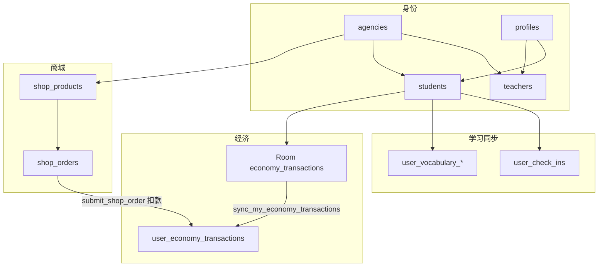

# Supabase 表地图（用途与交互）

更新日期：2026-08-04

配套：

- 权限边界：[permission_model.md](./permission_model.md)
- 代币账本细节：[economy_token_system.md](./economy_token_system.md)
- 废表清理：[legacy_schema_cleanup.md](./legacy_schema_cleanup.md)
- 历史体检快照：[supabase_schema_health_report.md](../2026-06-30/supabase_schema_health_report.md)

## 1. 总览

| 类别 | 表 | 状态 |
|------|-----|------|
| 身份 / 机构 | `agencies`、`profiles`、`students`、`teachers` | 在用 |
| 商城 | `shop_products`、`shop_orders` | 在用 |
| 经济（云） | `user_economy_transactions` | 在用（权威账本） |
| 学习同步 | `user_check_ins`、词汇进度三表 | 在用 |
| 词书内容 | `word_books`、`word_book_modules`、`vocabulary_words` | 远端有；App 按需下载 |
| 阅读内容 | `reading_sets`、`reading_questions`、`reading_options` | 远端 SSOT；自由刷（按学年）+ 作业选题 |
| 听力内容 | `listening_materials`、`listening_questions`、`listening_options` | 远端 SSOT；自由刷 + 作业选题 |
| 写作内容 | `writing_prompts` | 远端 SSOT；作文题目 |
| 练习作业 | `practice_assignments`、`practice_assignment_items`、`practice_assignment_recipients`、`practice_assignment_submissions` | 在用；阅读/听力/写作下发 |
| 读写完成标记 | `user_practice_item_completions` | 自由刷 + 已提交作业 items；跨设备 |
| Storage | `writing-submissions`（私有 bucket） | 作文原件/批改件 |
| Legacy | `content_*`、`study_events`、`points_ledger`、`rewards`、`redemptions` | **已由 015 从远端删除** |

原则：

- **云端权威**：余额以 `SUM(user_economy_transactions.amount)` 为准。
- **本地先写**：学习/任务/花园代币先入 Room `economy_transactions`，再 sync 上云。
- **商城扣款**：走服务端 RPC，直接写云端流水。

---

## 2. 身份与机构

| 表 | 用途 | 谁读写 | 交互 |
|----|------|--------|------|
| `agencies` | 机构根；一机构一店 | 平台用 `service_role` / `create_agency_admin` 建；Web `/agency` 隐含依赖 | `teachers.agency_id`、`students.agency_id`、`shop_*.agency_id` FK |
| `profiles` | Auth 用户资料、`role`、手机号、设备、**词汇量估测**（`vocabulary_size` / `vocabulary_estimated_at`） | App / Web 读；`set_my_profile` / `set_my_phone` / `set_my_device_id` / `set_my_vocabulary_estimate` 写 | `id` = `auth.users.id`；与 `students`/`teachers` 同 id；词汇量为最近一次分档检测结果，非背单词累计 |
| `students` | 学生扩展（姓名、教师绑定、机构） | App 登录恢复；Web 机构绑学生；教师看名下学生 | `teacher_id`、`agency_id`；商城按机构可见商品 |
| `teachers` | 教师扩展、所属机构 | Web 机构建教师 / 列表 | `agency_id`；同机构约束见 `010` |

相关 RPC（非表）：`create_agency_admin`、`create_teacher_account`、`create_student_account`、`bind_student_to_teacher`。

---

## 3. 商城

| 表 | 用途 | 谁读写 | 交互 |
|----|------|--------|------|
| `shop_products` | 机构店商品（价、库存、上下架） | Web 机构 CRUD；教师只读；学生只读上架 | `agency_id`；购买走 RPC 不直写订单表业务字段以外的扣款 |
| `shop_orders` | 学生订单；即时购买后多为 `completed` | 学生看自己的；机构/教师看本机构 | `submit_shop_order`：校验余额与库存 → 插订单 → 写负向 `user_economy_transactions` |

状态类型仍用 enum `redemption_status`（历史命名）；**不要**与已删的 `redemptions` 表混淆。

---

## 4. 经济双账本（流水记在哪）

### 4.1 两层

| 层 | 位置 | 角色 |
|----|------|------|
| 本地 | Room `economy_transactions` | **主写入**；`PENDING` → sync → `SYNCED` |
| 云端 | `public.user_economy_transactions` | **权威**；App 通过 `sync_my_economy_transactions`；商城 RPC 直写 |

`user_economy_transactions` **仍在用**。字段要点：`id`（UUID）、`user_id`、`amount`、`reason`、`ref_id`、`created_at`。

### 4.2 写入路径

1. 学习结算 / 每日任务 / 花园：`EconomyManager.addTokens` / `spendTokens` → 本地行 → `EconomyTransactionSyncer.syncAllToCloud`。
2. 网络恢复：`SyncManager` 的 `SyncScope.ALL` **包含** ECONOMY sync。
3. 商城：仅云端（订单 + 扣款流水）。

### 4.3 「云端最后一条很久以前」怎么理解

- **不是**换了别的流水表。
- 常见原因：该用户之后的变动还在本地 `PENDING`，或当时 sync 失败；也可能你看的是某个很久没上线的账号。
- 核对：App 侧该用户 `PENDING` 数量；云端 `SELECT MAX(created_at), COUNT(*) FROM user_economy_transactions`（全库）或按 `user_id` 过滤。
- 排障细节见 [economy_token_system.md](./economy_token_system.md)。

---

## 5. 学习同步

| 表 | 用途 | 谁写 | Syncer |
|----|------|------|--------|
| `user_check_ins` | 签到 | App | `CheckInSyncer` |
| `user_vocabulary_word_learning_progress` | 单词学习状态 | App | `VocabularyProgressSyncer` |
| `user_vocabulary_study_rounds` | 学习轮次 | App | 同上 |
| `user_vocabulary_book_progress` | 词书进度光标 | App | 同上 |

教师 / 机构通过 RLS +（教师）`get_teacher_student_stats` 只读汇总，不直接改这些表。

本地还有不同步或仅本地的表：`daily_tasks`、`garden_plots` 等（见 project_overview）。

---

## 6. 词书内容

| 表 | 用途 | 状态 |
|----|------|------|
| `word_books` | 词书元数据 | 远端 SSOT；App Profile「学习目标」按需下载 |
| `word_book_modules` | 模块 | 同上 |
| `vocabulary_words` | 词条（含 `senses` JSONB：多词性义项列表） | 同上 |

当前外研版初中六册（`difficulty` = 档位标签）：

| book_id | 册 |
|---------|-----|
| `fltrp-g7-vol1` … `fltrp-g9-vol2` | 七上～九下 |

- 导入产物：[`docs/words/fltrp_junior_words.json`](../words/fltrp_junior_words.json)；脚本 `scripts/extract_fltrp_words.py` / `scripts/apply_fltrp_word_books.py`
- 词汇检测从六册随机抽样（可不依赖「当前 active 词书」）；背单词仍用已下载 active 词书
- 与「学习进度」三表不同：这里是**内容**，进度在 `user_vocabulary_*`

---

## 6.1 阅读理解内容

| 表 | 用途 | 状态 |
|----|------|------|
| `reading_sets` | 短文套卷（passage、`grade`、`grade_band`、`content_origin`、难度、排序） | 远端 SSOT；公开 SELECT |
| `reading_questions` | 套内题目（题干、解析、`reward_token`、可选 `highlight_word`） | 同上 |
| `reading_options` | 选项 A–D | 同上 |

- 迁移：[`020_reading_comprehension_catalog.sql`](../../supabase/migrations/020_reading_comprehension_catalog.sql)、[`030_reading_grade_bands.sql`](../../supabase/migrations/030_reading_grade_bands.sql)
- `grade_band`：`g7a`…`g9b`（七上–九下）；自由练习按资料年级映射（初一→七上+七下，余类推）；非初中年级目录为空
- `content_origin`：`ai_generated` / `editorial` / `licensed`；**仅库内审计**，App / 教师端 UI 不展示
- App：学习中心「阅读训练」→ 模式选择 → **自由刷题**（按学年过滤目录，单套开练）或 **完成作业**（按 assignment items，**不**按年级挡）；**无**本地 assets / Room 题包
- 完成标记见 §6.1b；作业提交见 §6.2；结构说明见 [reading_grade_bands.md](../2026-08-07/reading_grade_bands.md)

---

## 6.1a 听力理解内容

| 表 | 用途 | 状态 |
|----|------|------|
| `listening_materials` | 听力材料（音频/文稿、排序） | 远端 SSOT；公开 SELECT |
| `listening_questions` / `listening_options` | 题与选项 | 同上 |

- App：与阅读相同双模式（自由刷题 / 作业）

---

## 6.1b 阅读/听力「做过」进度（跨设备）

| 表 | 用途 | 状态 |
|----|------|------|
| `user_practice_item_completions` | `(user_id, module_id, item_ref)`；自由刷题完成或作业提交后写入 | 在用；本人 RLS |

- 迁移：[`029_user_practice_item_completions.sql`](../../supabase/migrations/029_user_practice_item_completions.sql)
- RPC：`mark_my_practice_items_completed`（自由刷）；`submit_practice_assignment` 同步 upsert 作业内 items
- App 选题列表展示「已做过」徽章，不从题库移除；代币 `refId = free_{module}:{itemRef}`（作业仍为 `assignment:{submissionId}`）

---

## 6.2 练习作业（阅读 / 听力 / 写作）

| 表 | 用途 | 状态 |
|----|------|------|
| `practice_assignments` | 教师布置：`module_id` ∈ reading/listening/writing、标题、`due_at`、`allow_late` | 在用；教师/学员 SELECT via RLS |
| `practice_assignment_items` | 作业内引用（`item_ref` = set_id / material_id / prompt_id） | 同上 |
| `practice_assignment_recipients` | 下发学员快照 | 同上 |
| `practice_assignment_submissions` | 每学员一行；读写：`answer_payload` 回顾；写作：`original_path` / `annotated_path` / `score` / `feedback_text`；状态 `pending`→`in_progress`→`submitted`（写作再→`returned`） | 同上 |

- 迁移：[`022`](../../supabase/migrations/022_practice_assignments.sql)、[`023`](../../supabase/migrations/023_practice_assignments_grants.sql)、[`024`](../../supabase/migrations/024_practice_assignments_rls_no_recursion.sql)、[`026_writing_assignments.sql`](../../supabase/migrations/026_writing_assignments.sql)、[`029_user_practice_item_completions.sql`](../../supabase/migrations/029_user_practice_item_completions.sql)
- 写入 RPC：`create_practice_assignment` / `start_practice_assignment` / `submit_practice_assignment`（读写，提交时写 completions）；`submit_writing_assignment` / `return_writing_assignment`（写作）；`mark_my_practice_items_completed`（自由刷）
- Web：`/teacher/assignments`；写作批改 `/teacher/assignments/[id]/submissions/[submissionId]`
- App：阅读/听力先模式选择；作业列表两列；写作三列（未完成 / 批改中 / 已完成）
- Storage：私有 bucket `writing-submissions`，路径 `{assignment_id}/{submission_id}/original.*` 与 `annotated.*`

---

## 6.3 写作题目目录

| 表 | 用途 | 状态 |
|----|------|------|
| `writing_prompts` | 中考风格作文题（题干、词数、满分、`reward_token`） | 远端 SSOT；公开 SELECT |

- 迁移：[`025_writing_prompts_catalog.sql`](../../supabase/migrations/025_writing_prompts_catalog.sql)（种子 8 题 `w09-01`…`w09-08`）
- App：写作仍为作业-only（本轮无自由刷题）

---

## 7. 已删除（015）——避免再当在用

远端已 DROP（预检行数均为 0 后执行）：

| 表 | 原设计意图 |
|----|------------|
| `content_items` | 全局内容库条目 |
| `content_assignments` | 把内容**下发**给机构/学生（`agency_id` + 可选 `student_id` + `content_item_id`）。从未接产品 |
| `study_events` | 通用学习事件 JSON；后改进度同步表 |
| `points_ledger` | 旧积分流水；由 `user_economy_transactions` 替代 |
| `rewards` / `redemptions` | 旧奖励兑换；由 `shop_products` / `shop_orders` 替代 |

另删函数：`purchase_shop_product`（`submit_shop_order` 别名）、`record_my_economy_transaction`（已被 batch sync 取代）。

详见 [legacy_schema_cleanup.md](./legacy_schema_cleanup.md)。

---

## 8. 关键 RPC 速查

| RPC | 作用 |
|-----|------|
| `sync_my_economy_transactions` | 批量上传本地 PENDING 流水 |
| `get_my_token_balance` | 读本人云端余额（客户端；public INVOKER → private DEFINER） |
| `get_user_token_balance` | 内部汇总；现仅 `private.get_user_token_balance` |
| `submit_shop_order` | 即时购买 |
| `reconcile_my_token_balance` | 仅 `service_role` 运维 |
| `get_teacher_student_stats` | 教师看学生统计 |
| `set_my_profile` / `set_my_phone` / `set_my_device_id` | 资料 / 设备 |
| `set_my_vocabulary_estimate` | 写入词汇量估测 |
| `mark_my_practice_items_completed` | 自由刷题标记阅读/听力 item 已做过 |

EXECUTE / `search_path` 硬化见 [`016_security_definer_hardening.sql`](../../supabase/migrations/016_security_definer_hardening.sql) 与 [permission_model.md](./permission_model.md)。
