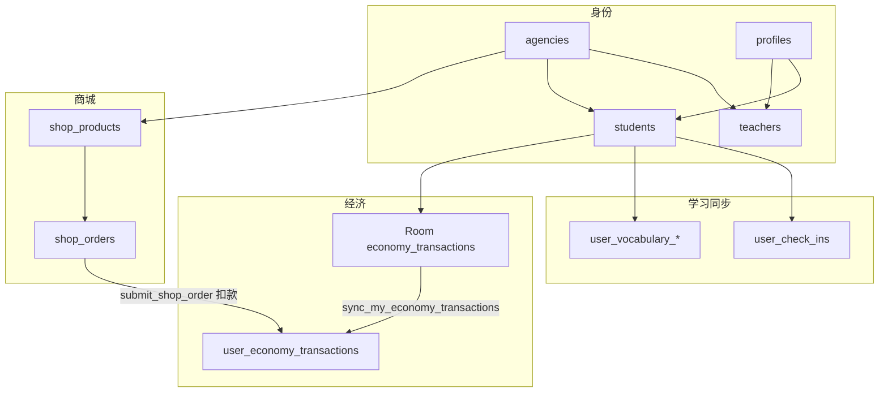

# Supabase 表地图（用途与交互）

更新日期：2026-07-24

配套：

- 权限边界：[permission_model.md](./permission_model.md)
- 代币账本细节：[economy_token_system.md](./economy_token_system.md)
- 废表清理：[legacy_schema_cleanup.md](./legacy_schema_cleanup.md)
- 历史体检快照：[supabase_schema_health_report.md](../2026-06-30/supabase_schema_health_report.md)

## 1. 总览

| 类别 | 表 | 状态 |
|------|-----|------|
| 身份 / 机构 | `agencies`、`profiles`、`students`、`teachers` | 在用 |
| 商城 | `shop_products`、`shop_orders` | 在用 |
| 经济（云） | `user_economy_transactions` | 在用（权威账本） |
| 学习同步 | `user_check_ins`、词汇进度三表 | 在用 |
| 词书内容 | `word_books`、`word_book_modules`、`vocabulary_words` | 远端有；App 下载未接完 |
| Legacy | `content_*`、`study_events`、`points_ledger`、`rewards`、`redemptions` | **已由 015 从远端删除** |

原则：

- **云端权威**：余额以 `SUM(user_economy_transactions.amount)` 为准。
- **本地先写**：学习/任务/花园代币先入 Room `economy_transactions`，再 sync 上云。
- **商城扣款**：走服务端 RPC，直接写云端流水。

---

## 2. 身份与机构

| 表 | 用途 | 谁读写 | 交互 |
|----|------|--------|------|
| `agencies` | 机构根；一机构一店 | 平台用 `service_role` / `create_agency_admin` 建；Web `/agency` 隐含依赖 | `teachers.agency_id`、`students.agency_id`、`shop_*.agency_id` FK |
| `profiles` | Auth 用户资料、`role`、手机号、设备 | App / Web 读；`set_my_profile` / `set_my_phone` / `set_my_device_id` 写 | `id` = `auth.users.id`；与 `students`/`teachers` 同 id |
| `students` | 学生扩展（姓名、教师绑定、机构） | App 登录恢复；Web 机构绑学生；教师看名下学生 | `teacher_id`、`agency_id`；商城按机构可见商品 |
| `teachers` | 教师扩展、所属机构 | Web 机构建教师 / 列表 | `agency_id`；同机构约束见 `010` |

相关 RPC（非表）：`create_agency_admin`、`create_teacher_account`、`create_student_account`、`bind_student_to_teacher`。

---

## 3. 商城

| 表 | 用途 | 谁读写 | 交互 |
|----|------|--------|------|
| `shop_products` | 机构店商品（价、库存、上下架） | Web 机构 CRUD；教师只读；学生只读上架 | `agency_id`；购买走 RPC 不直写订单表业务字段以外的扣款 |
| `shop_orders` | 学生订单；即时购买后多为 `completed` | 学生看自己的；机构/教师看本机构 | `submit_shop_order`：校验余额与库存 → 插订单 → 写负向 `user_economy_transactions` |

状态类型仍用 enum `redemption_status`（历史命名）；**不要**与已删的 `redemptions` 表混淆。

---

## 4. 经济双账本（流水记在哪）

### 4.1 两层

| 层 | 位置 | 角色 |
|----|------|------|
| 本地 | Room `economy_transactions` | **主写入**；`PENDING` → sync → `SYNCED` |
| 云端 | `public.user_economy_transactions` | **权威**；App 通过 `sync_my_economy_transactions`；商城 RPC 直写 |

`user_economy_transactions` **仍在用**。字段要点：`id`（UUID）、`user_id`、`amount`、`reason`、`ref_id`、`created_at`。

### 4.2 写入路径

1. 学习结算 / 每日任务 / 花园：`EconomyManager.addTokens` / `spendTokens` → 本地行 → `EconomyTransactionSyncer.syncAllToCloud`。
2. 网络恢复：`SyncManager` 的 `SyncScope.ALL` **包含** ECONOMY sync。
3. 商城：仅云端（订单 + 扣款流水）。

### 4.3 「云端最后一条很久以前」怎么理解

- **不是**换了别的流水表。
- 常见原因：该用户之后的变动还在本地 `PENDING`，或当时 sync 失败；也可能你看的是某个很久没上线的账号。
- 核对：App 侧该用户 `PENDING` 数量；云端 `SELECT MAX(created_at), COUNT(*) FROM user_economy_transactions`（全库）或按 `user_id` 过滤。
- 排障细节见 [economy_token_system.md](./economy_token_system.md)。

---

## 5. 学习同步

| 表 | 用途 | 谁写 | Syncer |
|----|------|------|--------|
| `user_check_ins` | 签到 | App | `CheckInSyncer` |
| `user_vocabulary_word_learning_progress` | 单词学习状态 | App | `VocabularyProgressSyncer` |
| `user_vocabulary_study_rounds` | 学习轮次 | App | 同上 |
| `user_vocabulary_book_progress` | 词书进度光标 | App | 同上 |

教师 / 机构通过 RLS +（教师）`get_teacher_student_stats` 只读汇总，不直接改这些表。

本地还有不同步或仅本地的表：`daily_tasks`、`garden_plots` 等（见 project_overview）。

---

## 6. 词书内容（预留）

| 表 | 用途 | 状态 |
|----|------|------|
| `word_books` | 词书元数据 | 远端有；App 按需下载未完成 |
| `word_book_modules` | 模块 | 同上 |
| `vocabulary_words` | 词条 | 同上 |

与「学习进度」三表不同：这里是**内容**，进度在 `user_vocabulary_*`。

---

## 7. 已删除（015）——避免再当在用

远端已 DROP（预检行数均为 0 后执行）：

| 表 | 原设计意图 |
|----|------------|
| `content_items` | 全局内容库条目 |
| `content_assignments` | 把内容**下发**给机构/学生（`agency_id` + 可选 `student_id` + `content_item_id`）。从未接产品 |
| `study_events` | 通用学习事件 JSON；后改进度同步表 |
| `points_ledger` | 旧积分流水；由 `user_economy_transactions` 替代 |
| `rewards` / `redemptions` | 旧奖励兑换；由 `shop_products` / `shop_orders` 替代 |

另删函数：`purchase_shop_product`（`submit_shop_order` 别名）、`record_my_economy_transaction`（已被 batch sync 取代）。

详见 [legacy_schema_cleanup.md](./legacy_schema_cleanup.md)。

---

## 8. 关键 RPC 速查

| RPC | 作用 |
|-----|------|
| `sync_my_economy_transactions` | 批量上传本地 PENDING 流水 |
| `get_my_token_balance` / `get_user_token_balance` | 读云端余额 |
| `submit_shop_order` | 即时购买 |
| `reconcile_my_token_balance` | 仅 `service_role` 运维 |
| `get_teacher_student_stats` | 教师看学生统计 |
| `set_my_profile` / `set_my_phone` / `set_my_device_id` | 资料 / 设备 |
